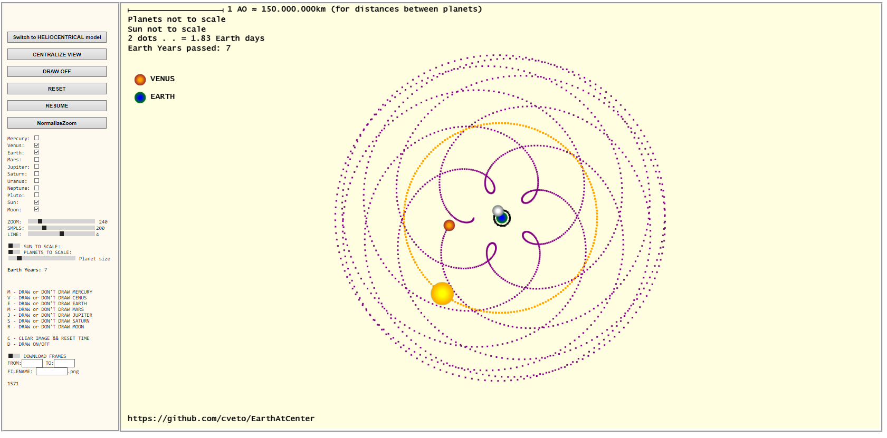
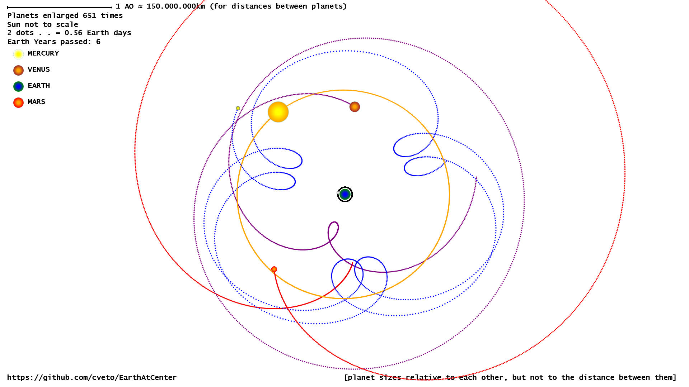
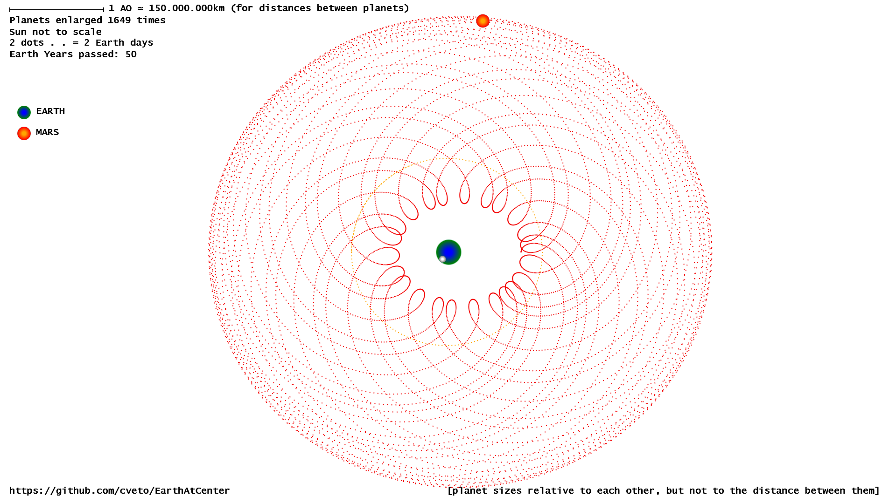

# EarthAtCenter

## How do he planetary orbits look like if we position Earth at the center?

This question bothered me since I was in primary school and it wasn't until the coronavirus i realized that I just might be able to visualize this with Javascript.. fairly easily.

- coded in Notepad++

